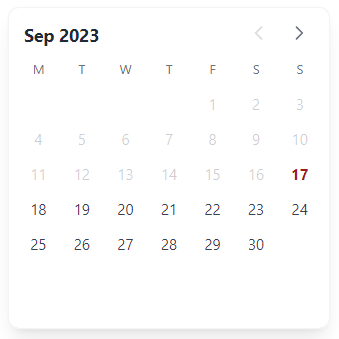

<h1 align="center">
Datepicker component.
</h1>

  

### Description

This is a simple datepicker using [Tailwindcss](https://tailwindcss.com/) and [Alpine.js](https://alpinejs.dev/).
 
There are multiple awesome datepickers to use, but most of them have limitations such as UI customization or changing the logic directly.
 
This simple component helps you make it your favorite date picker. :)
### How to use

- Just add `script.js` file to your project.
 
- Using CDNs, this component does not need to install tools for testing and use in the project.
 
- But I <b>recommend</b> installing [Tailwind](https://tailwindcss.com/docs/installation) and [Alpine](https://alpinejs.dev/essentials/installation) if you haven't already
 
 
I hope this component helps you!
